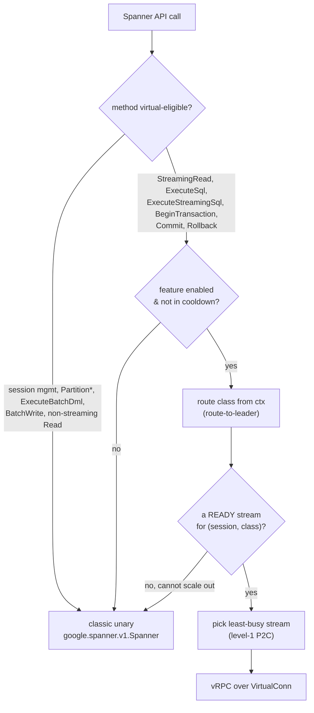
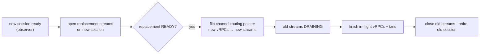

# Virtual RPC (vRPC) transport for the Cloud Spanner Go client

**Status:** Draft for review · **Scope:** `cloud.google.com/go/spanner` (Go) · **Author:** Rahul Yadav

## TL;DR

Cloud Spanner is adding a bidi-streaming "virtual RPC" transport: many logical
Spanner RPCs are multiplexed over a small number of long-lived gRPC bidirectional
streams ("HTTP/2-over-HTTP/2"), so the frontend amortizes per-connection TCP/TLS,
authentication, and per-RPC security/session module setup across many calls.

This document specifies how the Go client adopts that transport **without changing
the public API**. vRPC is an internal transport strategy that sits below the
existing data path; classic unary gRPC remains the fallback for every eligible
call. The design is derived from the verified server/gRPC contract (§2) and the
current client architecture (§4), both cited inline.

Two facts shape everything below:

1. A virtual RPC's backend is fixed when its **physical** stream is opened — an
   individual vRPC cannot be rerouted — so leader vs non-leader routing requires
   **two physical streams per channel**.
2. The server today exposes **no** control-plane signalling (the `ServerControl`
   message is empty) and **no** capability advertisement, so stream lifecycle,
   refresh, and feature enablement are entirely **client-driven**. §13 proposes
   adding server-driven signalling — as Cloud Bigtable already does for its
   multiplexed streaming — which the design is structured to adopt without rework.

---

## 1. Background and motivation

Today every Spanner data-plane call is an independent unary/server-streaming gRPC
RPC. Each incurs frontend cost: connection setup amortization is coarse, and the
frontend re-runs security/session context setup per RPC. The virtual-channel model
establishes one physical bidirectional stream and runs many lightweight virtual
RPCs inside it; the frontend sets up the stream's security/session context once and
reuses it, which is the primary win (server CPU and tail latency). Connection count
is a secondary consideration and may even rise briefly during refresh overlap.

The optimization priority — **server setup amortization > client tail latency >
connection count** — has a direct design consequence: **falling back to the classic
path is cheap** (it costs frontend CPU, not correctness, and little client latency).
The client may therefore fall back liberally, and transport complexity must never
trade correctness for latency.

---

## 2. The virtual-channel contract

### 2.1 The gRPC primitive

The client-side primitive ships in gRPC-Go under `experimental/session`
(CL 887182577):

```go
func StartSessionCall(ctx context.Context, cc *grpc.ClientConn, method string,
    req any, virtualOpts []grpc.DialOption, opts ...grpc.CallOption) (*Client, error)

type Client struct {
    VirtualConn *grpc.ClientConn // inner channel; issue virtual RPCs here
    Ack  <-chan error            // fires when the outer stream's Header() returns
    Done <-chan error            // fires when the physical stream terminates
}
```

`StartSessionCall` opens an outer bidi stream on `cc`, wraps its `SendMsg`/`RecvMsg`
as a `net.Conn`, and dials an inner `grpc.ClientConn` (`VirtualConn`) over that
connection. Virtual RPCs issued on `VirtualConn` are serialized to HTTP/2 frames and
carried as raw messages over the outer stream. The inner channel is created with
insecure credentials and `WithIdleTimeout(0)` — it carries **no** authentication of
its own; the outer stream is authenticated once and the frontend skips per-vRPC
auth modules.

```mermaid
sequenceDiagram
    participant App as Spanner client
    participant Phys as Physical ClientConn (DCP entry)
    participant FE as Cloud Frontend
    participant VC as VirtualConn (inner)

    App->>Phys: StartSessionCall(method, initReq, outer md)
    Phys->>FE: open outer bidi stream (resource-prefix, route-to-leader, auth)
    Note over App,VC: VirtualConn returned immediately; vRPCs may be sent before Ack
    App-)VC: Control vRPC (InitRequest)
    FE--)App: outer Header() ⇒ Ack
    VC-)FE: ExecuteStreamingSql vRPC (session in request)
    FE--)VC: PartialResultSet stream
    Note over Phys,FE: stream terminates ⇒ Done fires
```

### 2.2 The service surface

The data plane is a new service, `spanner.cloud.frontend.bidi_vrpc.SpannerVirtualRPC`
(baseline CL 918071581), gRPC/HTTP2-only, with **seven** methods:

| Method | Shape |
|---|---|
| `Control(stream ClientControl) → (stream ServerControl)` | bidi; **must be the first RPC on the service** |
| `StreamingRead`, `ExecuteStreamingSql` | server-streaming |
| `ExecuteSql`, `BeginTransaction`, `Commit`, `Rollback` | unary |

`ClientControl.InitRequest` and `ServerControl` (`InitResponse{}` only) are empty
messages; `Control` is a handshake, not a config channel.

Everything **not** in this list stays on the classic `google.spanner.v1.Spanner`
service: `CreateSession`/`BatchCreateSessions`/`GetSession`/`ListSessions`/
`DeleteSession`, `ExecuteBatchDml`, `BatchWrite`, non-streaming `Read`,
`PartitionQuery`/`PartitionRead`, plus admin/LRO. The client therefore runs a
**hybrid** transport (§5).

### 2.3 Contract constraints

The following are verified from the protos, the gRPC implementation, and the
frontend handler. Each drives a design decision.

| Constraint | Consequence |
|---|---|
| Leader/non-leader routing is pinned when the **outer** stream is established (via `x-goog-spanner-route-to-leader` metadata); the xDS route filter (CL 935589948) does route matching but no endpoint load-balancing, and a vRPC cannot move to another backend. Conflicting route metadata on an inner vRPC is ignored by the frontend. | **Two physical streams per channel** (leader, non-leader); route a vRPC strictly onto its matching stream. |
| Each physical stream is bound to exactly one multiplexed session for its lifetime. The frontend validates every vRPC's `session` against the stream and rejects a mismatch with `INTERNAL` ("Session uri mismatch with the stream"). | Stream identity includes the session; a mismatch is a fatal client routing bug, not a retryable error. |
| `ServerControl` is empty: no server-directed config, lifetime, limits, or drain signal. | Lifecycle, refresh, and gating are **client-owned** (§7, §8). |
| Auth, `x-goog-spanner-route-to-leader`, and `google-cloud-resource-prefix` are authoritative on the **outer** stream; `x-goog-spanner-request-id` (must be unique per call) and tracing metadata belong on the **inner** vRPC. | Explicit inner/outer metadata split (§5.3). |
| A vRPC may be sent before `Ack`; `Ack` means the outer stream's headers arrived, `Done` means the physical stream ended. | No "starting" stall; optimistic send is allowed (§7). |
| Per-vRPC deadlines are native (`grpc-timeout` on the inner frame); the outer stream is effectively deadline-less. | Outer and inner contexts are separated (§9). |
| The inner HTTP/2 stack fairly interleaves DATA frames, so a large streaming result does not head-of-line-block other vRPCs on the same physical stream. | The picker can count virtual RPCs flat, with no streaming weight (§5.4). |
| No per-vRPC "flushed to wire" signal exists; once bytes reach the adapter, delivery is **unknown** on stream failure. | `NOT_SENT` is provable only for pre-handshake failures; `Commit` retains its existing uncertainty semantics (§8). |
| No capability bit advertises `SpannerVirtualRPC`. | Enablement is by **speculative open** + `UNIMPLEMENTED` cooldown (§7). |
| GFE/AFE/`server-timing` headers appear only on the **outer** stream; the inner channel's target is `passthrough:///virtual_target`. | vRPC responses lack GFE timing; DirectPath detection must use the outer channel (§10). |
| `SpannerVirtualRPC` is registered only in the Cloud Frontend; the DirectPath backend does not expose it. `experimental/session` is not yet in a released gRPC-Go. | CloudPath-only at launch; build behind a tag, default off (§6, §11). |

A pending alternative, `CreateVirtualService` on the native Spanner service
(CL 906520295, `TRUSTED_TESTER_BIDI`), offers a typed session-open call instead of
the generic stub. The Go client targets the generic `StartSessionCall` for phase 1
and may adopt `CreateVirtualService` later.

---

## 3. Goals and non-goals

**Goals.** Preserve the public Go API and all Spanner semantics (sessions,
transactions, retries, commit uncertainty, tags, leader-aware routing, directed
reads). Amortize frontend setup for high-frequency data-plane calls. Reuse the
existing metrics, request-id, tracing, deadline, and retry machinery. Keep classic
fallback available for every eligible call throughout rollout. Stay
transport-structurally path-agnostic while shipping CloudPath-only first.

**Non-goals.** No public API change; no change to transaction or multiplexed-session
semantics; no vRPC for admin/LRO, partitioned, batch, or emulator paths in phase 1;
no general pending queue in phase 1; Java and other languages are out of scope.

---

## 4. Current client architecture

```text
spanner.Client (per database)
  └── sessionManager (single global multiplexed session)
  └── spannerClient interface            ← integration seam
        └── grpcSpannerClient → vkit/GAPIC client
              └── gtransport ConnPool / dynamic channel pool (DCP)
                    └── Cloud Frontend
```

Facts the design depends on, with sources:

- Multiplexed sessions are always enabled and the regular session pool has been
  removed (`client.go:788`). The session manager holds one global multiplexed
  session (`session.go:238-241`), replaces it in `finishMultiplexedSessionCreation`
  whose only downstream effect today is `dynamicPool.setPrimeSession(s.id)`
  (`session.go:366-379`), and refreshes it on a ~7-day timer (`session.go:566-593`).
  There is no rotation event for other components to subscribe to.
- `x-goog-spanner-route-to-leader` is attached per call in
  `contextWithOutgoingMetadata` unless disabled (`client.go:62-64, 477-487`);
  `google-cloud-resource-prefix` comes from `sc.md` (`client.go:723-737`,
  `sessionclient.go:130-147`).
- The outer channels install the built-in metrics unary/stream interceptors and
  keepalive in `allClientOpts` (`client.go:942-968`) and a request-id injector on
  each pool-construction path (`client.go:545-576, 760-765`).
- Streaming methods do **not** attach the request-id call option in
  `grpcSpannerClient`; the resumable stream decoder injects request IDs on each
  retry via a `requestIDHeaderProvider`, which is resolved by unwrapping known
  client types (`grpc_client.go:241-247`, `read.go:600-626`,
  `location_aware_client.go:90-109`).
- The dynamic channel pool computes per-channel load as `unaryLoad + streamLoad`
  counted through its RPC wrappers (`dynamic_channel_pool.go:859-863`), exposes only
  `Conn()` returning the first entry (`dynamic_channel_pool.go:256-263`), and primes
  a scaled-up channel with the current session (`dynamic_channel_pool.go:328-339`).
  The `GCPFallback` and multi-endpoint wrappers return a nil `Conn()`
  (`client.go:266-272, 503-512`).

The `spannerClient` interface (`grpc_client.go`) is the seam where vRPC plugs in.

---

## 5. Design — request path

### 5.1 Stream identity and route classes

A physical stream is bound to one session and one route class fixed at
establishment. With a single global session, the identity is:

```text
StreamIdentity = (mux-session, route-class),  route-class ∈ {default, leader}
```

So the client maintains effectively **two** stream identities. Each may hold one or
more physical streams across distinct channels (fan-out, §5.4). A request that
cannot be expressed as `(session, route-class)` — e.g. a directed-read requirement
the established route cannot satisfy — falls back to classic rather than spawning a
new identity.

### 5.2 Hybrid method routing



A routing wrapper around the `spannerClient` interface decides per call. Eligible
methods are tried on vRPC; everything else, and every failure to pick or start a
vRPC safely, delegates to the classic client unchanged.

### 5.3 Metadata contract

| Metadata | Where | Rationale |
|---|---|---|
| `google-cloud-resource-prefix` | outer | GFE/IAM inspect only the outer stream |
| `x-goog-spanner-route-to-leader` | outer | route pinned at establishment; inner ignored |
| credentials | outer | inner channel is insecure |
| `x-goog-spanner-request-id` | inner, unique per vRPC | a per-call id; outer-only would collapse all ids |
| tracing metadata | inner | per-vRPC spans (`ExecuteSql` vs `Commit`) |
| request/transaction tags | neither | already proto fields in `RequestOptions` |

Because the inner channel does not inherit interceptors installed on the physical
channel, the client builds a **separate** set of inner dial options that re-install
the request-id interceptor, the built-in metrics interceptors, user-provided stats
handlers, and default call options (max receive size, compression). The outer
metrics interceptors at `client.go:942-968` apply to the physical stream only.

The request-id path needs explicit handling: the routing wrapper implements
`requestIDHeaderProvider` (so `location_aware_client.go:90-109` can unwrap it) and
delegates id generation to the selected physical channel's `grpcSpannerClient`,
preserving the `clientID.channelID.nthRequest.attempt` numbering.

### 5.4 Picker and fan-out

The existing power-of-two-choices least-busy picker is reused with a different load
unit:

- **Level 1 — route a vRPC:** among READY streams for the request's
  `(session, route-class)`, choose the one with fewer in-flight virtual RPCs. Load
  unit is a flat virtual-RPC count (streaming and unary weighted equally, justified
  by fair interleave). If all matching streams are saturated, scale out or fall back.
- **Level 2 — place a new physical stream:** choose a channel via the existing
  least-busy-channel picker, excluding draining channels, and open a new stream
  there bound to the same identity.

**Fan-out** opens up to about one physical stream per identity per channel,
demand-driven, so a session's traffic is not funnelled onto a single channel. Local
client-side queueing when the inner channel reaches `MAX_CONCURRENT_STREAMS` is
handled by gRPC itself, so saturation is soft.

---

## 6. Design — channel selection and pool integration

The vRPC transport reuses the client's existing per-database channel pool rather
than building a dedicated one. Three integration points are required.

**Route-class selection.** A helper reads the same signal
`contextWithOutgoingMetadata` uses for `route-to-leader` and maps the call to
`(session, route-class)`. The outer stream is opened with that class in its
metadata; an inner vRPC may never change route class.

**Concrete physical channel.** `StartSessionCall` needs a concrete `*grpc.ClientConn`.
The DCP's `Conn()` returns only the first entry and bypasses the picker
(`dynamic_channel_pool.go:256-263`), and the fallback/multi-endpoint wrappers return
nil (`client.go:266-272, 503-512`). The pool therefore gains an explicit
`pickForVrpcStream(ctx)` that returns a concrete channel via the picker, and vRPC is
disabled for the fallback/multi-endpoint/location-aware wrappers in phase 1.

**Load and drain accounting.** A long-lived `StartSessionCall` stream is invisible
to `rpcLoad` (`dynamic_channel_pool.go:859-863`); without accounting, scale-down
could close a channel under live vRPCs, or — if naively counted as permanent load —
never complete. The pool tracks a dedicated vRPC-stream load that reflects last
in-flight activity (not mere stream existence) and exposes a draining callback so
the stream manager marks affected streams DRAINING and closes them only after their
in-flight vRPCs finish.

**Session rotation.** The session manager gains an observer interface so the vRPC
transport (and the DCP priming path) learn of session transitions instead of polling
`takeMultiplexed` (which is racy and cannot pinpoint the moment of replacement):

```go
type multiplexedSessionObserver interface {
    OnMuxSessionReady(oldID, newID string, reason rotateReason)
    OnMuxSessionInvalid(id string, reason invalidReason)
}
```

`OnMuxSessionReady` is fired from `finishMultiplexedSessionCreation`
(`session.go:366-379`) alongside the existing `setPrimeSession`, so the new session
is published atomically to both DCP priming and vRPC; `OnMuxSessionInvalid` is
driven by a `NOT_FOUND` on a vRPC.

---

## 7. Lifecycle, refresh, and enablement

### 7.1 Stream state machine

```mermaid
stateDiagram-v2
    [*] --> Dialing: pick (session, route-class) + concrete channel
    Dialing --> Starting: StartSessionCall (outer md: resource-prefix + route)
    Starting --> Ready: Ack (outer headers)
    note right of Starting: vRPCs may be sent before Ack
    Ready --> Rotating: NOT_FOUND(5) — session deleted
    Ready --> Rebuilding: Done / GOAWAY ⇒ UNAVAILABLE(14)
    Ready --> Teardown: INTERNAL(13) — session-uri mismatch
    Ready --> Rotating: client TTL (≈7-day refresh)
    Rotating --> Draining: replacement streams Ready; routing flipped
    Draining --> Closed: in-flight vRPCs + transactions finished
    Rebuilding --> Starting: reopen on the SAME session
    Teardown --> Closed
    Closed --> [*]
```



### 7.2 Refresh triggers (all client-driven)

There is no server lifetime or drain signal. Refresh is triggered by:

- **`NOT_FOUND` on a vRPC** — the bound session is gone. Rotate the session through
  the observer; the old identity drains, the new one is created lazily on next use.
- **`Done`/inner-GOAWAY** — the physical stream died; in-flight vRPCs fail
  `UNAVAILABLE` and the stream is rebuilt on the same (still-valid) session.
- **Client TTL** — aligned with the existing ~7-day session refresh
  (`session.go:566-593`), rotated ahead of expiry with jitter. There is no
  server-enforced outer-stream max duration; the route filter's `max_stream_duration`
  applies to inner vRPCs.

### 7.3 Make-before-break rotation

Old and new multiplexed sessions can be active simultaneously, so rotation never
stops the world:



New requests use the old streams until their channel flips; only a request landing
in the per-channel pointer swap waits, and only on the swap — never on a fleet-wide
rebuild.

### 7.4 Enablement and kill switch

There is no capability bit, so enablement is by speculative open under a local flag:
the first eligible request serves on classic and asynchronously opens one stream; if
`StartSessionCall` succeeds the stream becomes READY and subsequent requests use
vRPC; if the server returns `UNIMPLEMENTED` (feature or endpoint absent, including
DirectPath), the stream is closed and the feature cools down to classic. A local
flag or env kill switch, a high vRPC error rate, or capacity exhaustion all degrade
to classic and drain existing streams.

---

## 8. Failure handling and retry

The transport must never make an unsafe call look safe and must never weaken commit
uncertainty.

| Condition | Status | Action |
|---|---|---|
| Session-uri mismatch | `INTERNAL(13)` | fatal routing bug — tear down the stream, fall back; never retry on it |
| Bound session deleted | `NOT_FOUND(5)` | rotate the session (§6), rebuild streams on the new session |
| Stream drained / GOAWAY | `UNAVAILABLE(14)` | retry the vRPC on a new stream (same session likely still valid) |
| Other vRPC status | as returned | existing Spanner/GAX retry rules and `RetryInfo` |

Delivery classification follows from the absence of a flush signal: a failure is
`NOT_SENT` (safe to retry/fall back) only when it provably occurred **before** the
stream handshake; otherwise delivery is unknown. `Commit` gets no new cross-stream
retry — a `Commit` vRPC whose stream dies is treated exactly like a classic commit
whose stream died, governed by the existing commit-uncertainty machinery
(`transaction.go` commit path; default GAPIC `Commit` retries only on
`Unavailable`/`ResourceExhausted`, `apiv1/spanner_client.go:204-216`).

**Retry ownership.** Exactly one component owns retry. The resumable stream decoder
(`read.go:600-626`) continues to own stream-creation retry; the vRPC layer only maps
pick/start errors to retryable statuses **before bytes are sent**. No additional
retry loop is wrapped around a method that already uses GAX retry.

---

## 9. Deadlines

The two lifetimes are separated. The outer physical stream is created with a
**transport-owned** context tied to `Client.Close`/stream-manager lifecycle, never an
individual user RPC's context — a user deadline or cancel must not tear down the
shared stream. The inner vRPC uses the original per-call context, so `grpc-timeout`
and cancellation propagate natively on the inner frame. Per-call cancellation cancels
only that vRPC and decrements the in-flight count; the physical stream closes only
when gRPC reports the whole stream dead.

---

## 10. Observability

The built-in metrics path parses `grpc.Header` for `server-timing` and calls
`setDirectPathUsed(client.Context())` on the streaming response
(`grpc_client.go:241-257`). Over a virtual channel **neither works**: GFE/AFE
`server-timing` headers are present only on the outer stream, and the inner channel's
target is `passthrough:///virtual_target`. The vRPC path therefore skips the
server-timing parse (or reads it from the outer stream) and reports
`DirectPathUsed=false` based on the **outer** channel.

New transport metrics (no database/session labels): vRPC vs classic call counts,
fallback reason (bounded enum), call latency by path, active streams by route class,
stream-failure origin, and feature state (enabled/cooldown). Finer operational
detail (refresh/drain counts, open latency, per-channel slot usage) is emitted as
structured trace/log fields rather than always-on metrics.

---

## 11. DirectPath and dependency phasing

**Path.** `SpannerVirtualRPC` is CloudPath-only at launch. vRPC-stream creation is
gated on a capability bit that is true only for CloudPath channels; on a DirectPath
channel vRPC stays off and `UNIMPLEMENTED` cools it down. The transport is structured
above transport selection so enabling DirectPath later is a flag flip, not a redesign.
A path flip under a live stream is handled as a generic stream failure, not an
in-place migration.

**Dependency.** `experimental/session` is not yet in a released gRPC-Go. The vRPC
code lives behind a build tag (mirroring the existing `//go:build !disable_grpc_modules`
pattern in `grpc_dp.go`), default off, with no-op stubs under the default build so
the routing wrapper compiles and always falls back. A minimum gRPC-Go version is
pinned once the package lands in a release.

---

## 12. Rollout

1. Land behind a build tag + env gate, default off, with no-op stubs.
2. Wire the seams with no user traffic: inner dial options, route-class selection,
   request-id provider, `pickForVrpcStream`, DCP load/drain accounting, session
   rotation observer.
3. Speculative open + `UNIMPLEMENTED` cooldown; fail-closed gating.
4. Canary `ExecuteStreamingSql`/`StreamingRead` on CloudPath at a tiny fraction.
5. Ramp default-route read traffic; exercise the leader route class once default is
   stable.
6. Add `ExecuteSql` and other unary data-plane methods after streaming proves out.
7. Phase-2 DirectPath enablement via the capability bit once the backend registers
   the service.

A proof-of-concept validates the transport end-to-end against the in-memory mock
server: a single query, 64 concurrent virtual RPCs multiplexed on one physical
stream, and the `SpannerVirtualRPC` service with its `Control` handshake all succeed
in one process.

---

## 13. Proposal: server-driven lifecycle signalling

> This section is a **proposal to the server team**, not part of the current
> contract. The design above works without it; this describes a follow-up that
> would remove client-side guesswork.

Because `ServerControl` is empty, the client must drive refresh reactively (rotate
on `NOT_FOUND`, rebuild on `Done`) and proactively on a TTL guess, and must enable
the feature by speculatively opening a stream and backing off on `UNIMPLEMENTED`
(§7). This has real costs:

- **A reactive `NOT_FOUND` failure window.** The client learns the bound session is
  gone only when a vRPC fails, so a burst of in-flight vRPCs fails before rotation
  starts.
- **No server-coordinated drain.** The server cannot ask a client to migrate off a
  stream ahead of a backend rebalance or shutdown; the client only sees an abrupt
  transport failure.
- **TTL guesswork.** The client times session rotation on a fixed local interval
  rather than the server's actual lifetime.
- **Blind enablement.** With no capability bit, every client probes with a
  speculative open and a cooldown.

Today, a server-initiated drain on a virtual stream is just a raw HTTP/2 `GOAWAY`
on the inner transport, surfaced to the client as `UNAVAILABLE` — it carries no
information about which in-flight vRPCs the backend actually admitted, so the client
must treat their delivery as unknown (§8).

Cloud Bigtable already solves the equivalent problems with an **application-level**
`SessionResponse` envelope over its multiplexed streaming transport
(`google/bigtable/v2/session.proto`) rather than relying on raw transport signals.
We propose extending the (currently empty) `ServerControl` oneof with analogous
signals, modelled directly on Bigtable's:

| Bigtable precedent (`session.proto`) | Proposed `ServerControl` analogue | Effect on the Spanner client |
|---|---|---|
| `GoAwayResponse { int64 last_rpc_id_admitted }` | a drain message carrying the last admitted virtual-RPC id | Graceful handoff **plus a deterministic retry boundary**: the client learns exactly which vRPCs were admitted and which to retry, removing the "delivery unknown" ambiguity of §8. Feeds the existing `Draining` transition (§7.1). |
| `SessionRefreshConfig { OpenSessionRequest optimized_open_request, metadata }` | a server-pushed refresh hint with an optimized reopen payload | Replaces the client's TTL guess with a server-timed rotation (make-before-break, §7.3), avoids the `NOT_FOUND` window, and lets the replacement stream skip heavy setup on reopen. |
| `SessionParametersResponse` / `HeartbeatResponse` | dynamic stream parameters + application-level heartbeat | Server-tuned keep-alive (replacing the client's fixed ~5-min ping, §7) and idle-liveness validation; a `FeatureConfig{enabled, traffic_fraction}` here would also replace speculative-open + `UNIMPLEMENTED` cooldown (§7.4). |

**Why this is non-breaking for the client.** The lifecycle state machine (§7.1)
already models `Draining`, `Rotating`, and `Rebuilding`; these signals simply become
**additional triggers** for transitions the client already implements. The client
would prefer a server signal when present and fall back to the reactive/TTL behaviour
when absent, so a phased server rollout requires no client redesign. Adopting the
signals later is purely additive.

We recommend the server team prioritise the `GoAwayResponse`-style drain first (it
removes the sharpest failure mode — abrupt drops during rebalance, and gives a
deterministic retry boundary) and the `SessionRefreshConfig`-style refresh hint
second.

## 14. Open questions

- Whether `resource-prefix`/`x-goog-request-params` must be duplicated on inner
  vRPCs for server-side audit, or the outer stream is authoritative for all inner
  calls (current assumption: outer authoritative).
- The exact mechanism for surfacing outer-stream GFE/AFE timing per logical vRPC, or
  accepting payload query-stats only for vRPC traffic.
- Whether a read-write transaction must pin to one physical stream for its lifetime,
  or route-class matching suffices (phase 1 is read-only streaming; current
  assumption: route-class suffices, since the session is application-layer and the
  server validates per vRPC).
- Default fan-out cap and the vRPC-stream load weighting that feeds scale decisions.
- Cooldown duration and reset conditions for the `UNIMPLEMENTED`/error-rate path.
- Final released location and version of `experimental/session`, and whether to adopt
  the native `CreateVirtualService` open path (CL 906520295).

---

## Appendix A — component overview (Go)

| Component | Responsibility |
|---|---|
| `routingSpannerClient` | wraps `spannerClient`; per-call vRPC-vs-classic decision; implements `requestIDHeaderProvider` |
| `vrpcTransport` | per `spanner.Client`; owns stream managers by identity; registers as `multiplexedSessionObserver`; reuses the DCP |
| `vrpcStreamManager` | per identity: level-1 pick, fan-out, refresh, drain |
| `vrpcStreamHandle` | one physical stream + `VirtualConn`; state, in-flight count, `Ack`/`Done` watchers |
| `vrpcSpannerClient` | implements `spannerClient` for the seven virtual methods over a `VirtualConn`; stream adapters return the existing `spannerpb` stream interfaces |
| inner dial-option builder | reconstructs interceptors/stats/call-options for the inner channel |
| `pickForVrpcStream` | concrete per-channel selection on the dynamic pool |

All of the above live behind the `spanner_vrpc` build tag; the default build ships
no-op stubs that always fall back to classic.
